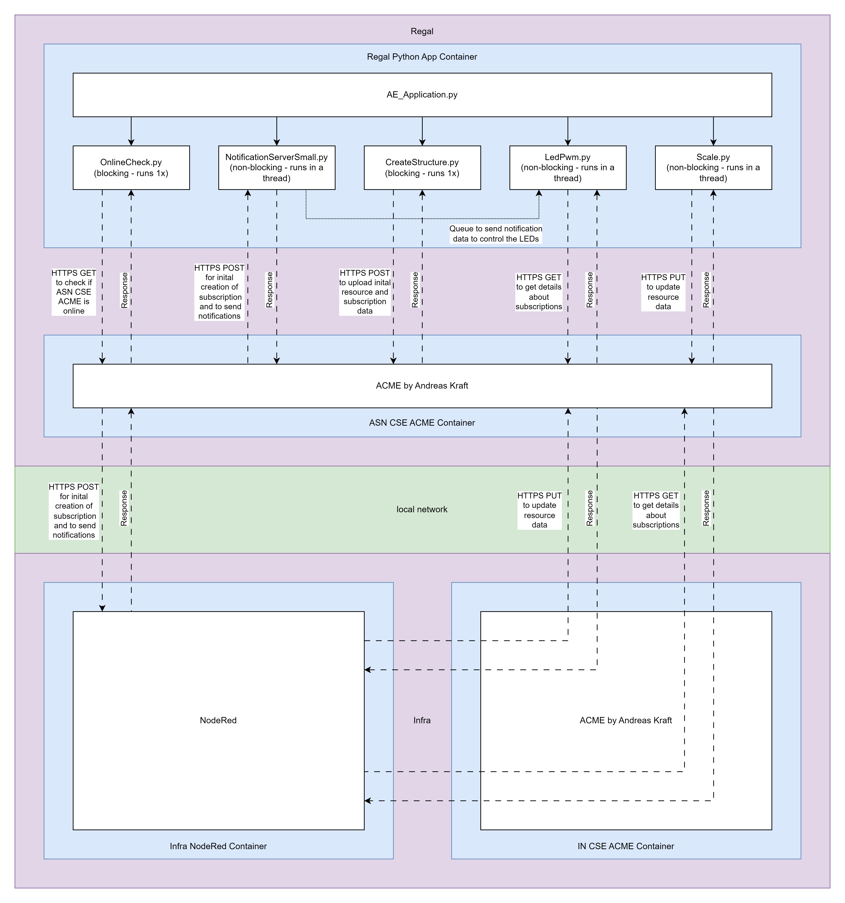

# Advanced IoT Systems Development
## Introduction Intelligent OneM2M Warehouse System

The Intelligent Warehouse System aims to be a scaleable solution for giving an overview of the stock in a warehouse. It supports especially small goods with high quantities (e.g. screws). The system uses scales to determine the weight of these small goods in boxes and provides useful information via a dashboard to users. It also consists of LEDs to indicate the stock of each good directly in the warehouse to get a quick overview or easily find wares which need to be restocked. 

### Basic Setup 
The system consists of several Raspberry Pi Zero which are linked together over a network. The Raspberry Pis are split into two roles:
- Central node: Consisting of one Raspberry Pi controling the Dashboard and the whole infrastructure. 
- Shelf Nodes: Consisting of Raspberry Pis that collect weight data and controll the LEDs. 

 using the OneM2M standard. 

## Hardware Setup:
### Hardware Components:
- Raspberyy Pi Zero WH (WiFi and Header Pins) * 3
- Transcend TS16GUSD300S-A 16GB microSDHC * 3
- AZ-Delivery KY-016 FZ0455 3-colors RGB LED module * 4
- DollaTek Small Scale 10 kg Load Cell with HX711 A/D * 4
- Power Supply 5V 1A (or better) * 3
- Additional Female to Female Jumper Wire

### Hardware Systemoverview:

### Raspberry Pi Pinout:

## Software Setup:
### Software List:
- Raspberry Pi OS Lite 32 bit
- Docker (docker.io and docker-compose)
- ACME oneM2M CSE: https://github.com/ankraft/ACME-oneM2M-CSE
- Node-RED w/ node-red-dashboard
- HX711 python library: https://github.com/gandalf15/HX711
- avahi-utils
### System overview

### Software Data Flows

### Operating System:
As the Operating System Raspberry Pi OS Lite 32 bit is used. This OS can be downloaded and flashed onto a microSD card with the Raspberry Pi Imager utility.
### Raspberry Pi OS Config:
- hostname: `acme-in`, `acme-regal-1` or `acme-regal-2`
- enable ssh
- username `acme`
- password `acme`
- setup your WiFi (don't forget the WiFi country) or connect with an Ethernet adpater
- setting the keyboard language is usefull if you need to connect a keyboard via USB
### Install gerneral apt packages
```
sudo apt update
```
```
sudo apt upgrade
```
```
sudo apt install git
```
### clone git
- Create Troken for your git account: https://github.com/settings/tokens (give the token a name, set an expiration date and select the scope "repo")
- Clone with this command (replace <your_token> with your new token):
```
git clone https://<your_token>@github.com/io22m007/AID
```
tell git that the directory is a save directory
```
git config --global --add safe.directory /home/acme/AID
```
### docker
install docker:
```
sudo apt install docker.io docker-compose
```
add current user to docker group:
```
sudo usermod -aG docker $USER
```
enable docker at startup:
```
sudo systemctl enable --now docker
```
restart system:
```
sudo shutdown -r now
```
### calibrate scale
Install python3 pip natively:
```
sudo apt install python3-pip 
```
Install the HX711 library natively:
```
sudo rm /usr/lib/python3.11/EXTERNALLY-MANAGED
pip3 install 'git+https://github.com/gandalf15/HX711.git#egg=HX711&subdirectory=HX711_Python3'
```
To calibrate the scale you need to run the `scale-calibrate.py` python app. This app can be found in the `Tools` folder.
```
python /AID/Tools/scale-calibrate.py
```
You'll need an object of which you know the exact weight.

Follow the instructions in the python app and copy the config string into the `ae.ini` file. This file can be found here:
- /AID/Docker/Regal-1/ae/ae.ini
- /AID/Docker/Regal-2/ae/ae.ini

### run docker container
switch to one of these folders:
- /AID/Docker/Infra
- /AID/Docker/Regal-1
- /AID/Docker/Regal-2
start docker container:
```
docker-compose up --build
```
start docker container in the background:
```
docker-compose up --build -d
```
## Helpful commands:
[a list of helpful commands can be found here](Command-Help.md)
